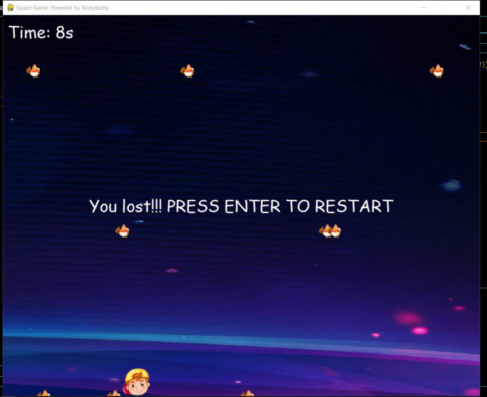

# python_space_game



## Description

This is a simple space-themed game built using Python and Pygame. The player controls a spaceship and must navigate through obstacles while collecting points.

## Features

- Player-controlled spaceship
- Randomly generated obstacles
- Score tracking
- Sound effects

## Installation

1. Make sure you have Python installed. You can download it from [python.org](https://www.python.org/downloads/).

2. Install Pygame by running the following command in your terminal or command prompt:

    ```
    pip install pygame
    ```

3. Clone this repository:

    ```
    git clone https://github.com/yourusername/python-space-game.git
    ```

4. Navigate to the project directory:

    ```
    cd python-space-game
    ```

5. Run the game:

    ```
    python main.py
    ```

## Controls

- Use the arrow keys to move the spaceship.
- Press the spacebar to shoot.

## Gameplay

- Dodge obstacles while collecting points.
- The game ends if the spaceship collides with an obstacle.

## Contributing

Contributions are welcome! If you'd like to contribute to this project, please follow these guidelines:

1. Fork the repository
2. Create a new branch (`git checkout -b feature/yourfeature`)
3. Make your changes
4. Commit your changes (`git commit -am 'Add some feature'`)
5. Push to the branch (`git push origin feature/yourfeature`)
6. Create a new Pull Request

## License

This project is licensed under the [MIT License](LICENSE).

## Contact

If you have any questions or suggestions, feel free to contact me:
- Call/Whatsapp: 263774603865
- Email: nobytechy@gmail.com
- GitHub:https://github.com/nobytechy

